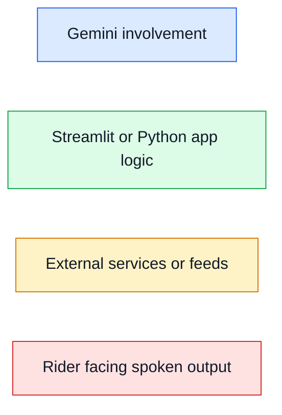
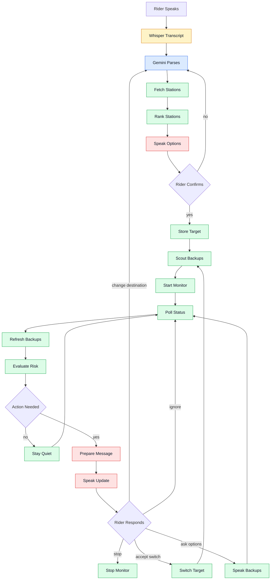
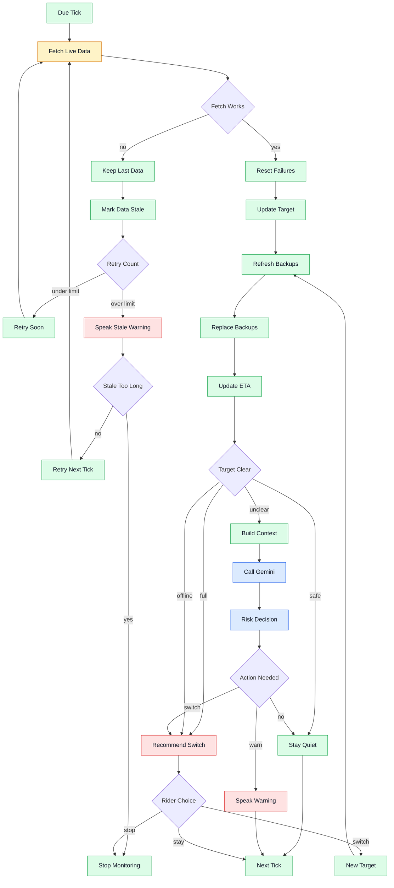
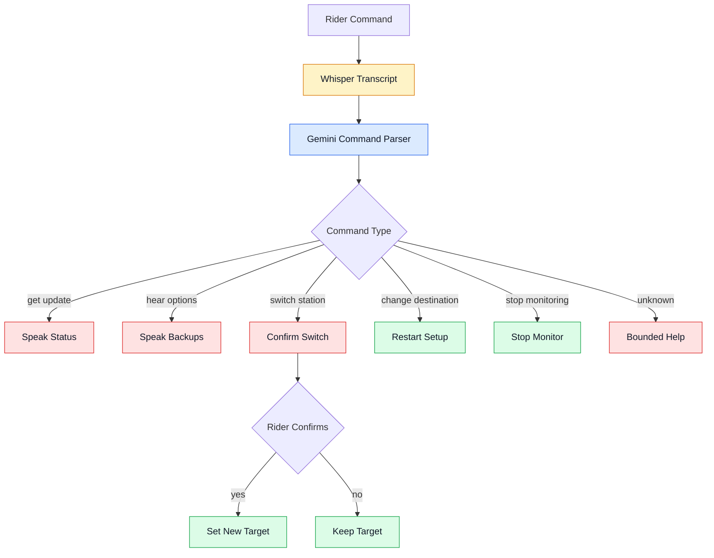
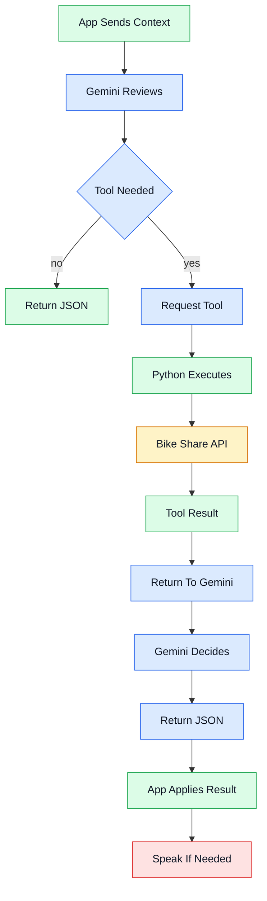

# DockTalk Rider Journey Flow

## Goal

This diagram shows how the rider journey works from the first voice request through monitoring, risk evaluation, alternative station scouting, and rider commands.

Audience: project team.

Diagram type: flowchart. This is the clearest format for seeing the rider journey and the decision points before coding.

## Key Components

- Rider: speaks requests and confirms choices.
- Streamlit App: owns the UI, session state, and monitor loop.
- Whisper: turns rider speech into text.
- Gemini: parses intent and helps with contextual risk.
- Bike Share API: provides live station data.
- Station Scout: keeps backup stations ready.
- Alert Logic: decides whether to stay quiet or speak.

## Color Legend

## Overall Journey

## Monitor Loop Detail

## Rider Command Loop

## Gemini Tool Calling Detail

## What This Shows

DockTalk has two loops after setup: the monitor loop and the rider command loop. The monitor loop checks live station data and decides whether an update is worth speaking. The rider command loop lets the rider ask for updates, hear options, switch stations, change destination, or stop monitoring.

## What To Notice

The backup station scout runs quietly in the background. The rider hears about backups only when they ask or when the target station risk becomes actionable.

Gemini is not the timer or the data source. Streamlit and Python run the monitor loop, while Gemini helps with parsing, contextual risk, and spoken wording.

For tool calling, Gemini should request tools from the app, but Python should execute them. Gemini should not invent stations or dock counts. It should receive tool results, then return structured JSON that the app can validate and apply.
